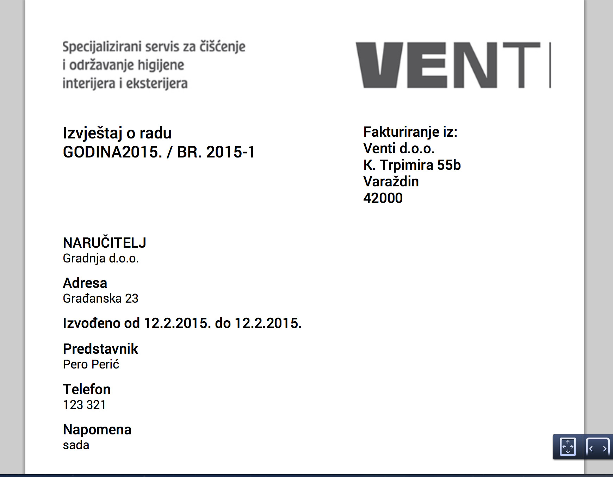

# Opis
U ovom diplomskom radu cilj nam je prikazati drugačiji pristup razvoju web aplikacija. Većina sadašnjih web aplikacija oslanja se na LAMP arhitekturu same aplikacije. Slobodno možemo reći da je ovaj način razvijanja web aplikacija trenutno najrasprostranjeniji, no također postoje i druga rješenja. Jedno od njih prikazat ću u ovom diplomskom radu te ću povući kratku koleraciju između LAMP i MEAN web stack-a. Nakon toga ću pokušati opisati na kojem principu rade nerelacijske baze te ih usporediti s relacijskim bazama, zašto koristiti Node.js te koje su njegove prednosti i mane, što nam pruža Express.js i za što se uopće koristi. Naposljetku ćemo razmotriti koje su dobre i loše strane selidbe logike same aplikacije sa servera na klijenta, za to ćemo koristiti trenutno najrasprostranjeniji frontend framework, a to je Angular.js koji je razvijen od strane Google-a. Unutar naše frontend aplikacije prikazat ćemo komunikaciju između klijenta i servera pomoću REST-a. Pošto sve više aplikacija radi na asinkronom pristupu, REST dolazi kao odličan kanal za komunikaciju. Također nam REST pristup pruža vrlo jednostavnu integraciju s aplikacijama koje su podržane na više platformi tipa iOS, Android, Windows Phone itd.

#Instalacija razvojnog okruženja na OSX
* Potrebno je instalirat [brew](http://brew.sh/)
* Pomocu brew-a instaliramo node `brew install node`
* Također instaliramo mongodb `brew install mongodb`
* Kako bi mongo radio potrebno je dodati varijable unutar našeg bash_profile-a
```
export MONGO_PATH=/usr/local/mongodb  
export PATH=$PATH:$MONGO_PATH/bin
```

#Instalacija projekta
* Potrebno je isklonirat projekt `git clone git@github.com:dinodsaurus/venti.git`
* Nakon kloniranja instaliramo sve projektne zavisnosti `cd venti && npm install`
* Potrebno je instalirat sve frontend zavisnosti`cd app && bower install`
* Pokrenemo mongo bazu sa `mongod`
* Unutar novog terminal prozora pokrenemo node server `cd .. && node server.js`
* Za pokretanje naše frontend aplikacije izvršimo `gulp serve` unutar novog terminal prozora
* Nakon ovog naš projekt bi se uspješno trebao pokrenuti na `http://localhost:3002/`

# Struktura
* Čitava frontend logika nalazi se unutar `app` foldera
* Čitava backend logika nalazi se unutar `server.js` file-a
* Svi modeli unutar baze podataka nalaze se unutar `models` foldera

###Happy coding!

### Preview



